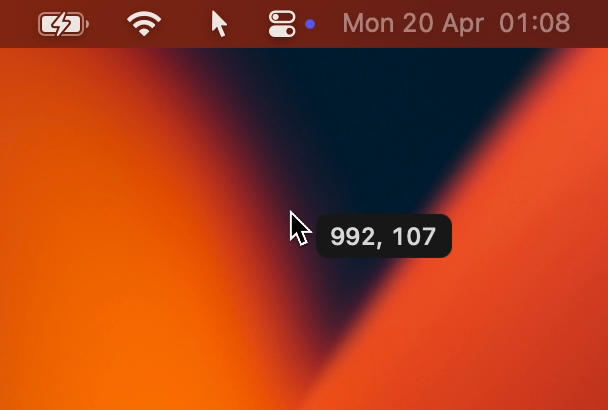

# Pointer Coordinates

> A lightweight macOS menu bar app that displays the current cursor position as a floating label next to the pointer, updated in real time at around 60 FPS.




A compact pill label follows the cursor in real time, sitting just to its right and below the tip. Coordinates use a top-left origin — matching the native macOS screenshot tool — with monospaced digits so the label width stays stable as values change. The overlay is click-through, appears on all Spaces, and adapts to Light and Dark Mode automatically.

## Usage

The app lives in the menu bar. Click the icon to open the menu, then choose **Quit** to exit.

## Command Line

### Build and launch

Compiles the app from source, stops any already-running instance, and launches the result.

```bash
bash build.sh
```

### Launch

Starts the pre-built app without recompiling.

```bash
open PointerCoordinates.app
```

### Stop

Terminates the running app process by its exact binary name.

```bash
pkill -x PointerCoordinates
```

### Toggle

Checks whether the app is currently running and either stops it or starts it accordingly. Useful for binding to a keyboard shortcut or a shell alias.

```bash
if pgrep -x PointerCoordinates > /dev/null; then
    pkill -x PointerCoordinates
else
    open /path/to/PointerCoordinates.app
fi
```

## License

[MIT](LICENSE)
